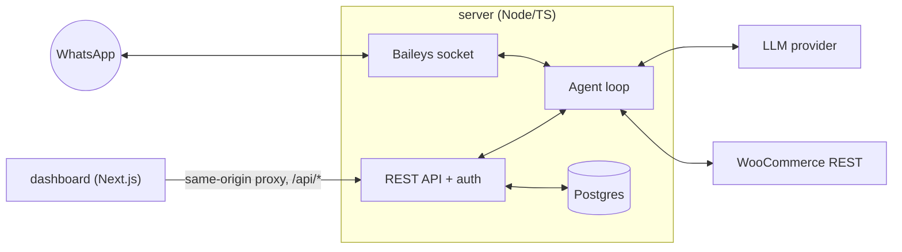

<p align="center">
  
</p>

<h1 align="center">Arix</h1>

<p align="center">
  Open-source AI sales agent for WooCommerce, on WhatsApp.<br/>
  Self-hosted, multi-LLM, ready in minutes.
</p>

<p align="center">
  <a href="https://github.com/tiagoadjim/arix/actions/workflows/ci.yml"></a>
  <a href="LICENSE"></a>
  <a href="CONTRIBUTING.md"></a>
</p>

<p align="center">
  🇦🇷 <a href="docs/README.es.md">Leé esto en español</a>
</p>

Arix answers your customers on WhatsApp, sells from your live WooCommerce
catalog, reads payment receipts, and keeps your orders up to date — with a
human always one click away. Everything runs on infrastructure you own:
Postgres, receipt files, and session data never leave your server.

## What it does

- **Sells from your live catalog** — stock, prices, and variants come straight
  from the WooCommerce REST API, never from a script or a stale copy.
- **Reads payment receipts** — a customer sends a photo or PDF of a transfer;
  the agent reads the amount with vision and matches it against the order.
- **Updates orders** — confirmed payments move the WooCommerce order to the
  next status automatically, with a tolerance for small amount mismatches.
- **Hands off to a human** — staff take over any conversation from the
  dashboard inbox, reply from there, and hand it back to the agent.
- **Knows your business hours** — replies are aware of your configured
  schedule and timezone.

<!-- Screenshots: dashboard inbox, conversation view, and setup wizard go here. -->

## Architecture



`server` is the only backend: it owns Postgres, the REST API, auth, receipt
storage, and the WhatsApp socket. `dashboard` never touches the database — it
proxies `/api/*` to `server` at the same origin, so there's no CORS to manage
and no second set of credentials to configure.

## Supported AI providers

Pick one in the setup wizard (or set `LLM_PROVIDER` up front). All providers
are used through the same OpenAI-compatible client — model and base URL are
overridable per deployment.

| Provider | Default model | Tool calling | Vision (receipt reading) |
|---|---|:---:|:---:|
| OpenAI | `gpt-5.4-mini` | Yes | Yes |
| Anthropic Claude | `claude-sonnet-5` | Yes | Yes |
| Google Gemini | `gemini-3.5-flash` | Yes | Yes |
| DeepSeek | `deepseek-v4-flash` | Yes | No |
| MiniMax | `MiniMax-M3` | Yes | Yes |

DeepSeek has no vision support today: instead of reading the receipt image,
the agent asks the customer for the order number and amount in text, or hands
off to a human — your choice, set per deployment.

## Quickstart (Docker)

Three steps, ending at the setup wizard — only secrets and the database
password need manual configuration.

1. **Configure the minimum:**

   ```bash
   cp env.example .env
   ```

   Open `.env` and set `AUTH_JWT_SECRET`, `SETTINGS_ENCRYPTION_KEY`, and
   `SETUP_TOKEN` (generate all three independently with
   `openssl rand -hex 32`), plus a `POSTGRES_PASSWORD`. Everything else — LLM provider, WooCommerce
   credentials, business profile — is configured from the dashboard next.

2. **Start everything:**

   ```bash
   docker compose up -d --build
   ```

   Postgres, the server, and the dashboard all come up together; the schema
   migrates itself on first boot. Compose binds the dashboard only to
   `127.0.0.1`; do not widen that binding or publish it before creating the
   first administrator.

3. **Open `http://localhost:3000`.** You'll land on the setup wizard. Paste
   the `SETUP_TOKEN` from `.env` to create the one and only bootstrap admin,
   then pick and test an AI provider, connect
   WooCommerce, fill in your business profile, and scan the WhatsApp QR code
   — right there in the browser, no log-scanning required. If a QR expires,
   there's a regenerate button.

That's it — Arix is live. The break-glass CLI (`create-staff`, for when the
wizard isn't reachable) is documented in [`CONTRIBUTING.md`](CONTRIBUTING.md).

## Local development

Requirements: Node 24.x LTS, [pnpm](https://pnpm.io), and a
Postgres instance (local or Docker).

```bash
pnpm install
cp env.example .env              # fill in DATABASE_URL, AUTH_JWT_SECRET and SETUP_TOKEN
pnpm dev:server                  # terminal 1 — API + WhatsApp gateway
pnpm dev:dashboard                # terminal 2 — http://localhost:3000
```

To read PDF receipts locally (rasterized to an image for vision), install
poppler: `brew install poppler` (macOS) or `apt install poppler-utils`
(Linux). Docker already includes it. Without poppler, the agent simply asks
for a photo instead of a PDF.

```bash
pnpm typecheck      # TypeScript, both packages
pnpm test           # server + dashboard suites (Vitest)
pnpm --filter @arix/dashboard test:e2e  # critical browser flows (Playwright)
pnpm lint           # ESLint; warnings fail locally and in CI
pnpm build          # production builds, server + dashboard
pnpm audit:prod     # production dependency audit
```

## Configuration

Almost everything — LLM provider and key, WooCommerce credentials, business
profile, agent persona, payment/shipping info — lives encrypted in Postgres
and is edited from the dashboard's Settings page (or the first-run wizard).
Secrets are encrypted at rest with versioned AES-256-GCM envelopes and an
independent `SETTINGS_ENCRYPTION_KEY`; they are never sent to the browser in
plaintext. Existing installations can temporarily fall back to the legacy
JWT-derived key while rotating.

Any of those fields can also be **seeded from an environment variable** (see
`env.example`, section 2). Precedence is **env > database > default**: while
an env var is set, it wins and shows as read-only in the dashboard — useful
for infra-managed deployments that don't want secrets touched through the UI.

Only a handful of variables are env-only (no dashboard equivalent):

| Variable | Default | Purpose |
|---|---|---|
| `AUTH_JWT_SECRET` | — (required) | Session signing only. Rotating it logs everyone out. Use a different value from the settings key. |
| `SETUP_TOKEN` | — (required) | One-shot credential entered to create the first admin (min 32 chars); never exposed as a dashboard environment variable. |
| `SETTINGS_ENCRYPTION_KEY` | JWT fallback | Active AES settings key (min 32 chars); strongly recommended for new/production installs. |
| `SETTINGS_ENCRYPTION_KEY_PREVIOUS` | — | Comma-separated old settings keys kept temporarily while startup re-encrypts stored secrets. |
| `POSTGRES_USER` / `POSTGRES_PASSWORD` / `POSTGRES_DB` | `arix` / — / `arix` | Docker Compose's Postgres container + the server's connection string. |
| `DATABASE_URL` | — | Local dev only — points the server at your own Postgres (Compose sets this internally). |
| `PORT` | `3001` | Server API port (not published to the host in Docker). |
| `RECEIPTS_DIR` | `./data/receipts` | Where receipt images are stored (a volume in Docker). |
| `MAX_MEDIA_BYTES` / `MAX_PDF_BYTES` | `10485760` | Download and PDF receipt size limits (10 MiB each). |
| `PDF_TIMEOUT_MS` | `15000` | Hard timeout for PDF rasterization. |
| `RECEIPT_RETENTION_DAYS` | `90` | Receipt-file retention; `0` or less disables cleanup. |
| `ALLOW_PRIVATE_NETWORKS` | `false` | Explicit opt-in for a trusted WooCommerce host on a LAN/private IP. |
| `ALLOW_INSECURE_HTTP` | `false` | Explicit opt-in for HTTP; keep disabled for public integrations. |
| `LOG_LEVEL` | `info` | pino log level. |
| `COOKIE_SECURE` | `false` | Set `true` when serving the dashboard over HTTPS (see the VPS guide). |
| `WA_ACCOUNT_ID` | `default` | Namespaces the WhatsApp session stored in Postgres. |
| `WA_MARK_ONLINE` | `false` | Whether WhatsApp shows the account as online. |
| `WA_QR_TERMINAL` | `false` | Print pairing QR in terminal logs; leave off and use the authenticated dashboard. |
| `AGENT_HISTORY_LIMIT` | `30` | Messages of conversation history kept per reply. |
| `AGENT_DEBOUNCE_MS` | `60000` | Wait after the customer's last message before replying (batches quick follow-ups). |
| `AGENT_MAX_BUBBLES` | `3` | Max WhatsApp bubbles per reply. |
| `AGENT_TURN_TIMEOUT_MS` | `90000` | Total budget for an agent turn across retries, backoff, and tools. |

## Deploying to a VPS

See [`docs/deploy-vps.md`](docs/deploy-vps.md) for a concise walkthrough:
Caddy as a reverse proxy with automatic HTTPS, setting `COOKIE_SECURE=true`,
backups, and zero-downtime updates.

## How it works

- **Debounce batching** — the agent waits `AGENT_DEBOUNCE_MS` (default 60s)
  after the customer's last message before replying, so a burst of quick
  messages gets read and answered together instead of one reply per message.
- **Grounding lock** — the agent is never allowed to state a price or stock
  level from memory: product questions force a live `search_catalog` call
  first, so it can't invent numbers.
- **Safe payment review** — the amount read from a receipt is compared against
  the order total in code, duplicate receipt hashes are rejected, and matches
  require staff review by default. Automatic confirmation is an explicit
  opt-in intended only for deployments with independent reconciliation; a
  refunded or cancelled order can never be silently reactivated.
- **Versioned migrations** — schema changes ship as numbered SQL files in
  `server/src/db/migrations/`, applied once each and tracked in a
  `schema_migrations` table. Safe to run on every boot.

## Security & privacy

- Everything self-hosts on your own infrastructure: Postgres, receipt files,
  and WhatsApp session data live in your Docker volumes, not a third party.
- API keys and WooCommerce credentials are encrypted at rest
  (AES-256-GCM) and are never returned to the browser in plaintext.
- Auth is a signed JWT cookie over your own staff table (bcrypt-hashed
  passwords) — no external identity provider required.
- Set `COOKIE_SECURE=true` and serve the dashboard over HTTPS in production
  (see the VPS guide).
- The only data that leaves your infrastructure is what's necessary for the
  product to work: messages/receipts to your chosen LLM provider, and order
  reads/writes to your WooCommerce store.

### Disclaimer

Arix connects to WhatsApp through [Baileys](https://github.com/WhiskeySockets/Baileys),
an **unofficial** WhatsApp Web client — not something Meta provides or
endorses. Using it carries a real risk of the connected number being banned.
Don't use Arix for bulk/marketing messaging or anything that looks like spam;
it's built for answering inbound customer conversations, not outbound blasts.

## Roadmap

Planned, no committed dates:

- Shopify support
- Tiendanube support
- More dashboard languages
- Realtime (SSE) inbox, replacing polling
- Usage/cost analytics panel
- Additional messaging channels (evaluating)
- Role-based staff permissions (admin vs agent)

## Contributing

See [`CONTRIBUTING.md`](CONTRIBUTING.md) for the dev setup, test commands, and
PR expectations.

## License & credits

MIT — see [`LICENSE`](LICENSE).

Developed by [tiagoadjim](https://github.com/tiagoadjim).
