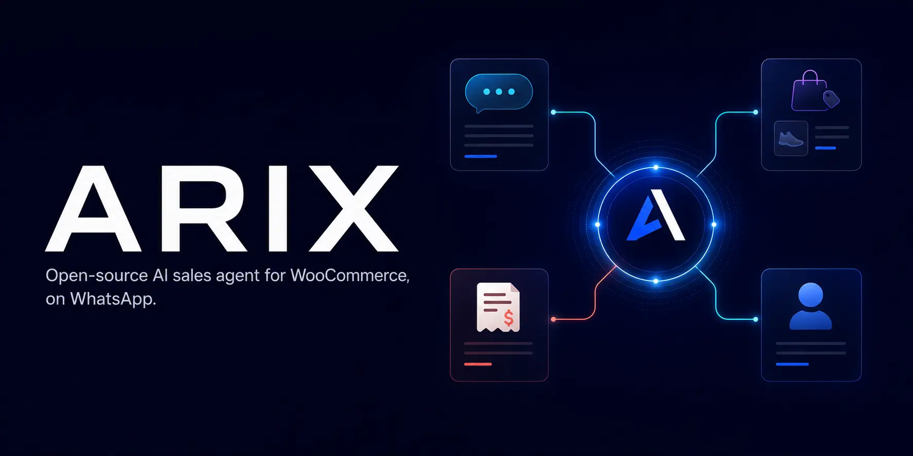
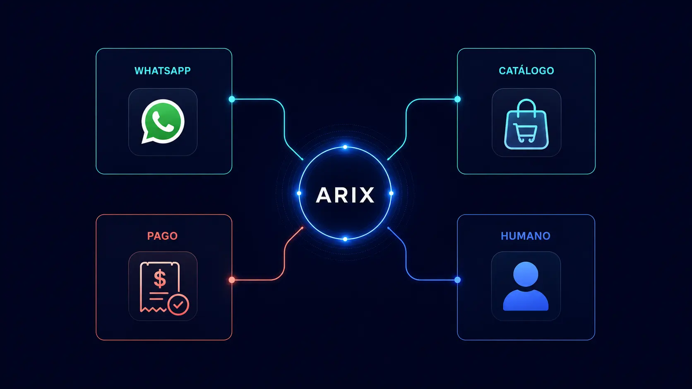
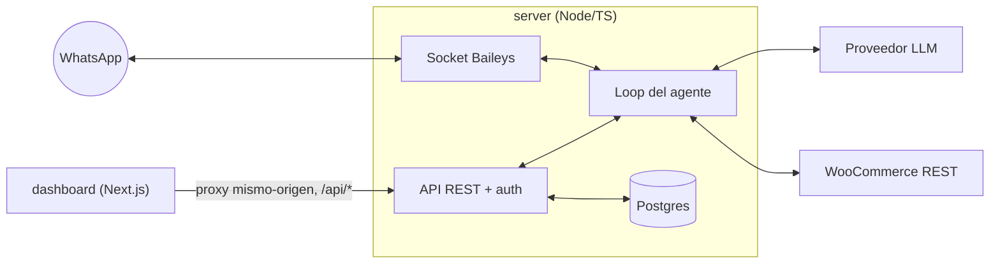

<p align="center">
  
</p>

<p align="center">
  <a href="https://github.com/tiagoadjim/arix/actions/workflows/ci.yml"></a>
  <a href="../LICENSE"></a>
  <a href="../CONTRIBUTING.md"></a>
</p>

<p align="center">
  🇬🇧 <a href="../README.md">Read this in English</a>
</p>

Arix responde a tus clientes por WhatsApp, vende desde tu catálogo de
WooCommerce en vivo, lee comprobantes de pago y mantiene tus órdenes al día
— con un humano siempre a un clic de distancia. Todo corre en infraestructura
propia: Postgres, los archivos de comprobantes y los datos de sesión nunca
salen de tu servidor.

## Qué hace

- **Vende desde tu catálogo en vivo** — stock, precios y variantes salen
  directamente de la API REST de WooCommerce, nunca de un script o una copia
  desactualizada.
- **Lee comprobantes de pago** — el cliente manda una foto o un PDF de una
  transferencia; el agente lee el monto con visión y lo compara contra la
  orden.
- **Actualiza órdenes** — un pago confirmado mueve la orden de WooCommerce al
  siguiente estado automáticamente, con una tolerancia para pequeñas
  diferencias de monto.
- **Deriva a un humano** — el staff toma cualquier conversación desde el
  inbox del dashboard, responde desde ahí y se la devuelve al agente.
- **Conoce el horario del negocio** — las respuestas tienen en cuenta el
  horario y el huso horario configurados.

<p align="center">
  
</p>

## Arquitectura



`server` es el único backend: es dueño de Postgres, la API REST, la
autenticación, el storage de comprobantes y el socket de WhatsApp. El
`dashboard` nunca toca la base de datos — reescribe `/api/*` hacia `server`
en el mismo origen, así no hay que lidiar con CORS ni con un segundo set de
credenciales.

## Proveedores de IA soportados

Elegí uno en el wizard de configuración (o definí `LLM_PROVIDER` de
antemano). Todos los proveedores se usan a través del mismo cliente
compatible con OpenAI — el modelo y la URL base se pueden sobrescribir por
despliegue.

| Proveedor | Modelo por defecto | Function calling | Visión (lectura de comprobantes) |
|---|---|:---:|:---:|
| OpenAI | `gpt-5.4-mini` | Sí | Sí |
| Anthropic Claude | `claude-sonnet-5` | Sí | Sí |
| Google Gemini | `gemini-3.5-flash` | Sí | Sí |
| DeepSeek | `deepseek-v4-flash` | Sí | No |
| MiniMax | `MiniMax-M3` | Sí | Sí |

DeepSeek no tiene soporte de visión hoy: en lugar de leer la imagen del
comprobante, el agente le pide al cliente el número de orden y el monto por
texto, o deriva a un humano — la elección es tuya, se configura por
despliegue.

## Puesta en marcha rápida (Docker)

Tres pasos, terminando en el wizard de configuración — sin editar archivos
de config a mano más que un secreto.

1. **Configurá lo mínimo:**

   ```bash
   cp env.example .env
   ```

   Abrí `.env` y completá `AUTH_JWT_SECRET` (generá uno con
   `openssl rand -hex 32`) y un `POSTGRES_PASSWORD`. Todo lo demás —
   proveedor de IA, credenciales de WooCommerce, perfil del negocio — se
   configura después desde el dashboard.

2. **Levantá todo:**

   ```bash
   docker compose up -d --build
   ```

   Postgres, el server y el dashboard arrancan juntos; el schema se migra
   solo en el primer arranque.

3. **Abrí `http://localhost:3000`.** Vas a caer en el wizard de
   configuración: creá una cuenta de admin, elegí y probá un proveedor de
   IA, conectá WooCommerce, completá el perfil del negocio y escaneá el QR
   de WhatsApp — ahí mismo en el navegador, sin necesidad de mirar logs. Si
   un QR expira, hay un botón para regenerarlo.

Listo — Arix está en producción. El CLI de emergencia (`create-staff`, para
cuando el wizard no está disponible) está documentado en
[`CONTRIBUTING.md`](../CONTRIBUTING.md).

## Desarrollo local

Requisitos: Node 20+ (probado con Node 24), [pnpm](https://pnpm.io), y una
instancia de Postgres (local o Docker).

```bash
pnpm install
cp env.example .env              # completá DATABASE_URL y AUTH_JWT_SECRET
pnpm dev:server                  # terminal 1 — API + gateway de WhatsApp
pnpm dev:dashboard                # terminal 2 — http://localhost:3000
```

Para leer comprobantes en PDF localmente (se rasterizan a imagen para la
visión), instalá poppler: `brew install poppler` (macOS) o
`apt install poppler-utils` (Linux). Docker ya lo incluye. Sin poppler, el
agente simplemente pide una foto en lugar de un PDF.

```bash
pnpm -w typecheck   # TypeScript, ambos paquetes
pnpm test           # suite de tests del server (vitest)
pnpm lint           # eslint (no bloqueante en CI)
```

## Configuración

Casi todo — proveedor de IA y su clave, credenciales de WooCommerce, perfil
del negocio, persona del agente, info de pagos/envíos — vive cifrado en
Postgres y se edita desde la página de Configuración del dashboard (o desde
el wizard del primer arranque). Los secretos se cifran en reposo
(AES-256-GCM, clave derivada de `AUTH_JWT_SECRET`) y nunca se envían al
navegador en texto plano.

Cualquiera de esos campos también se puede **sembrar desde una variable de
entorno** (ver `env.example`, sección 2). La precedencia es **env > base de
datos > default**: mientras una variable de entorno esté definida, gana y
se muestra como solo-lectura en el dashboard — útil para despliegues
gestionados por infraestructura que no quieren que los secretos se toquen
desde la UI.

Solo un puñado de variables son exclusivas de entorno (sin equivalente en
el dashboard):

| Variable | Default | Propósito |
|---|---|---|
| `AUTH_JWT_SECRET` | — (requerida) | Raíz de firma de sesión + cifrado de configuración. Rotarla desloguea a todos e invalida los secretos guardados. |
| `POSTGRES_USER` / `POSTGRES_PASSWORD` / `POSTGRES_DB` | `arix` / — / `arix` | El contenedor de Postgres de Docker Compose + el connection string del server. |
| `DATABASE_URL` | — | Solo desarrollo local — apunta el server a tu propio Postgres (Compose lo define internamente). |
| `PORT` | `3001` | Puerto de la API del server (no se publica al host en Docker). |
| `RECEIPTS_DIR` | `./data/receipts` | Dónde se guardan las imágenes de comprobantes (un volumen en Docker). |
| `LOG_LEVEL` | `info` | Nivel de log de pino. |
| `COOKIE_SECURE` | `false` | Poné `true` cuando sirvas el dashboard sobre HTTPS (ver la guía de VPS). |
| `WA_ACCOUNT_ID` | `default` | Namespacea la sesión de WhatsApp guardada en Postgres. |
| `WA_MARK_ONLINE` | `false` | Si WhatsApp muestra la cuenta como en línea. |
| `AGENT_HISTORY_LIMIT` | `30` | Mensajes de historial de conversación por respuesta. |
| `AGENT_DEBOUNCE_MS` | `60000` | Espera tras el último mensaje del cliente antes de responder (agrupa mensajes seguidos). |
| `AGENT_MAX_BUBBLES` | `3` | Máximo de burbujas de WhatsApp por respuesta. |

## Desplegar en un VPS

Ver [`docs/deploy-vps.md`](deploy-vps.md) (en inglés) para una guía
concisa: Caddy como proxy reverso con HTTPS automático, cómo poner
`COOKIE_SECURE=true`, backups, y actualizaciones sin downtime.

## Cómo funciona

- **Agrupado por espera (debounce)** — el agente espera `AGENT_DEBOUNCE_MS`
  (60s por defecto) tras el último mensaje del cliente antes de responder,
  así una ráfaga de mensajes seguidos se lee y se responde junta, en lugar
  de una respuesta por mensaje.
- **Bloqueo de grounding** — el agente nunca puede afirmar un precio o un
  stock de memoria: las preguntas sobre productos fuerzan primero una
  llamada real a `search_catalog`, así no puede inventar números.
- **Validación de pago determinística** — el monto leído del comprobante se
  compara contra el total de la orden en código (con una tolerancia
  configurable), y un pago solo puede confirmar una orden que todavía esté
  en un estado pre-pago — una orden reembolsada o cancelada nunca se puede
  reactivar en silencio.
- **Migraciones versionadas** — los cambios de schema se distribuyen como
  archivos SQL numerados en `server/src/db/migrations/`, cada uno se aplica
  una sola vez y queda registrado en una tabla `schema_migrations`. Seguro
  de correr en cada arranque.

## Seguridad y privacidad

<p align="center">
  
</p>

- Todo se autoaloja en tu propia infraestructura: Postgres, los archivos de
  comprobantes y los datos de sesión de WhatsApp viven en tus volúmenes de
  Docker, no en un tercero.
- Las claves de API y las credenciales de WooCommerce se cifran en reposo
  (AES-256-GCM) y nunca se devuelven al navegador en texto plano.
- La autenticación es una cookie JWT firmada sobre tu propia tabla de staff
  (contraseñas hasheadas con bcrypt) — no hace falta un proveedor de
  identidad externo.
- Poné `COOKIE_SECURE=true` y serví el dashboard sobre HTTPS en producción
  (ver la guía de VPS).
- El único dato que sale de tu infraestructura es el necesario para que el
  producto funcione: mensajes/comprobantes hacia el proveedor de IA que
  elegiste, y lecturas/escrituras de órdenes hacia tu tienda WooCommerce.

### Aviso

Arix se conecta a WhatsApp a través de
[Baileys](https://github.com/WhiskeySockets/Baileys), un cliente de
WhatsApp Web **no oficial** — algo que Meta no provee ni avala. Usarlo
implica un riesgo real de que el número conectado sea baneado. No uses Arix
para mensajería masiva/marketing ni para nada que parezca spam; está
pensado para responder conversaciones entrantes de clientes, no para
enviar campañas salientes.

## Roadmap

Planeado, sin fechas comprometidas:

- Soporte para Shopify
- Soporte para Tiendanube
- Más idiomas en el dashboard
- Inbox en tiempo real (SSE), reemplazando el polling
- Panel de analítica de uso/costos
- Canales de mensajería adicionales (evaluando)
- Permisos de equipo basados en roles (admin vs agente)

## Contribuir

Ver [`CONTRIBUTING.md`](../CONTRIBUTING.md) (en inglés) para la puesta en
marcha de desarrollo, los comandos de test y qué se espera de un PR.

## Licencia y créditos

MIT — ver [`LICENSE`](../LICENSE).

Desarrollado por [tiagoadjim](https://github.com/tiagoadjim).
